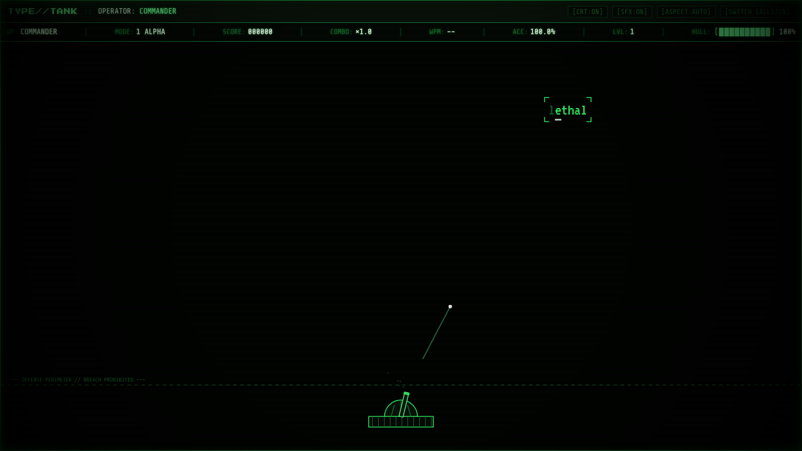
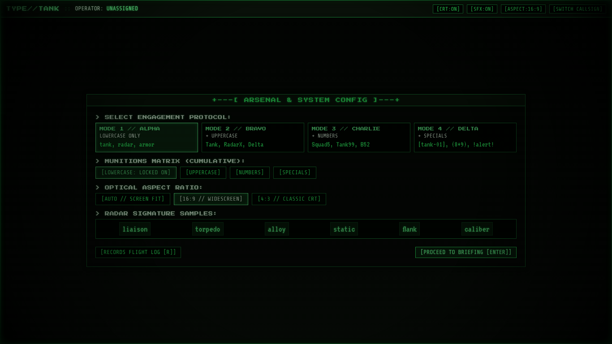
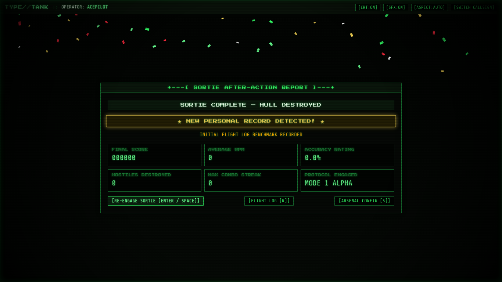

# 🛡️ TYPE//TANK — Terminal Typing Defense

> **A high-intensity retro military terminal typing-defense game built with vanilla HTML5, Canvas 2D, CSS shaders, and Web Audio synthesis.**

<p align="left">
  <a href="https://developer.mozilla.org/en-US/docs/Web/HTML"></a>
  <a href="https://developer.mozilla.org/en-US/docs/Web/CSS"></a>
  <a href="https://developer.mozilla.org/en-US/docs/Web/JavaScript"></a>
  <a href="#"></a>
  <a href="#"></a>
  <a href="#"></a>
  <a href="#"></a>
</p>

---

## 📖 Overview

**TYPE//TANK** transforms high-speed keyboard typing into an authentic 80s/90s DOS arcade military defense terminal. Defend the perimeter boundary from descending hostiles using precision keyboard artillery.

Every visual element is rendered natively via **HTML5 Canvas 2D and CSS scanline shaders**, and all sound effects are generated procedurally in real-time via the browser's **Web Audio API** (`AudioContext`). It runs anywhere with zero dependencies by opening `index.html` directly.

<table align="center" width="100%">
  <tr>
    <td width="33%" align="center"><b>⚔️ Live Combat & Homing Bullets</b></td>
    <td width="33%" align="center"><b>⚙️ Arsenal & Aspect Config</b></td>
    <td width="33%" align="center"><b>★ Sortie Debrief & Records</b></td>
  </tr>
  <tr>
    <td width="33%"></td>
    <td width="33%"></td>
    <td width="33%"></td>
  </tr>
</table>

---

## ✨ Key Features

- **🎯 Tactical Radar Targeting**: Type the first character to acquire lock. The engine prioritizes the **lowest hostile on screen** (maximum `y` coordinate). Lock holds until eliminated.
- **🚀 Homing Artillery & Physics**: Each keystroke fires a shell that homing-tracks the exact moving character coordinate in real time with tracer lines and impact spark bursts.
- **🧨 Crimson Priority Targets**: High-velocity crimson hostiles award a **3.5× score multiplier**. Enforced with an active character exclusion and a **3-second cooldown** after neutralization.
- **🎛️ 4 Cumulative Engagement Protocols**:
  - **Mode 1 // ALPHA**: Pure lowercase tactical vocabulary
  - **Mode 2 // BRAVO**: + Uppercase letters and proper nouns
  - **Mode 3 // CHARLIE**: + Alphanumeric military designations
  - **Mode 4 // DELTA**: + Special characters, mathematical expressions, and shell commands
- **📻 100% Procedural Web Audio Engine**: Zero external audio files. 10 procedural sound effects synthesized on the fly: downward square laser sweeps, noise-filtered explosions, dual-tone chimes, hull crunch, and celebratory arpeggios.
- **🖥️ CRT Shaders & Dynamic Cabinet Aspect Controller**:
  - **AUTO [SCREEN FIT]**: Fills the browser window responsively.
  - **16:9 [WIDESCREEN]**: Centered widescreen cabinet with cathode shadows.
  - **4:3 [CLASSIC CRT]**: Classic arcade monitor with side pillarbox bezels.
  - Zero-scroll guarantee at 1024×600, 1366×768, and 1920×1080 at 100% zoom.
- **📜 Flight Log & Personal Best Tracking**: Versioned `localStorage` engine (`typetank:v1`) logging up to 200 sorties per callsign, delta comparisons, and celebratory confetti.

---

## 🎮 Operational Controls

| Input | Action |
| :--- | :--- |
| `A-Z`, `0-9`, symbols | Acquire target and fire artillery shells |
| `[BACKSPACE]` | Disengage current radar lock (progress remains dimmed) |
| `[ESC]` | Tactical Pause menu / Abort sortie |
| `[ENTER]` / `[SPACE]` | Advance briefing, confirm dialogs, or quick re-engage |
| `[R]` | Open Flight Log Records |
| `[S]` | Open Arsenal & Display Configuration |
| `[C]` / `[M]` | Toggle CRT Scanline Shader / Audio Mute |

---

## 🏗️ Architecture

```
3 - Typing Master/
├── index.html        # Semantic DOM sections, header marquee, HUD row, overlays
├── style.css         # Theme tokens, CRT shaders, aspect-ratio cabinet, DOS panels
└── js/
    ├── words.js      # 4 mode dictionaries (160+ words each) & SpawnExclusion manager
    ├── audio.js      # Synthesizer engine (lazy AudioContext, master gain, voice limiter)
    ├── storage.js    # Versioned localStorage (typetank:v1) & in-memory fallback
    ├── game.js       # 60 FPS Canvas 2D engine, turret recoil, homing bullets, targeting
    └── app.js        # State machine, cabinet aspect controller, keyboard router
```

---

## 🚀 Quick Start

No installation or build steps required. Simply open `index.html` in any modern web browser:

```bash
# Direct launch in your default browser
xdg-open index.html   # Linux
open index.html       # macOS
start index.html      # Windows
```

To run the automated Playwright smoke tests:
```bash
npm install
node test/smoke.js
```
